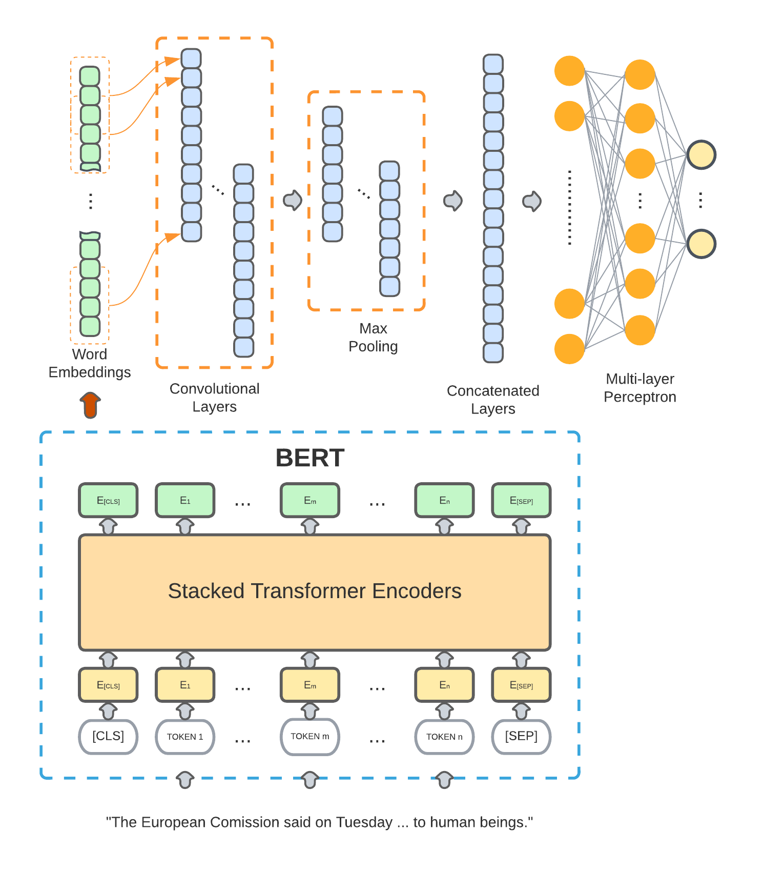

# Introduction
TopoBERT, a toponym recognition module based on a one-dimensional Convolutional Neural Network (CNN) and Bidirectional Encoder Representation from Transformers (BERT). 

The struture of the model is shown in the figure below:



# How to deploy
1. Clone the source codes and place in a path that your project can access.
2. Download the pretrained models and place it in the pretrained_model folder.
3. Download the required dependencies:

4. Ready to use.


# Use case

```python
from topo_bert import *  # Refer to the path you put your downloaded files

test_text = """HarveyStorm over Austin TX at 8: 00 AM CDT via Weather Underground"""
current_geoparser = TopoBERT()
result = current_geoparser.predict(test_text)
print(result)

```
