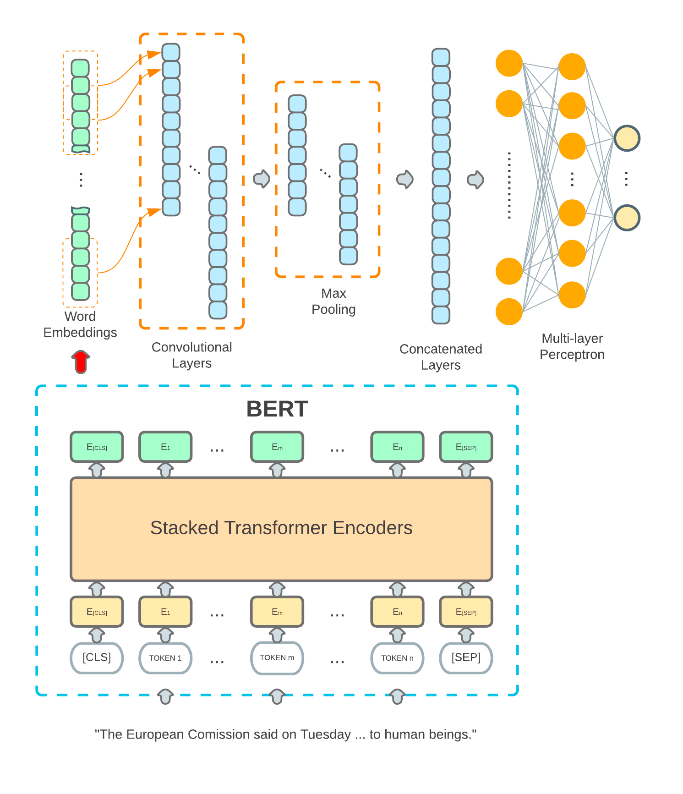

# Introduction
TopoBERT, a toponym recognition module based on a one-dimensional Convolutional Neural Network (CNN) and Bidirectional Encoder Representation from Transformers (BERT). 

The struture of the model is shown in the figure below:



# Performance
The model is trained using CoNLL-2003 and evaluated with Harvey2017.

Evaluated with Harvey2017 comparing with other popular models:

|     Model                            |     Precision    |     Recall    |     F1-score    |
|--------------------------------------|------------------|---------------|-----------------|
|     Stanford NER (broad location)    |     0.729        |     0.440     |     0.548       |
|     spaCy NER (board location)       |     0.461        |     0.304     |     0.366       |
|     BiLSTM-CRF                       |     0.703        |     0.600     |     0.649       |
|     DM_NLP                           |     0.729        |     0.680     |     0.703       |
|     NeuroTPR                         |     0.787        |     0.678     |     0.728       |
|     TopoBERT                         |     0.898        |     0.835     |   **0.865**     |

# Requirements
geojson	2.5.0 <br>
matplotlib	3.4.3<br>
nltk	3.6.5<br>
numpy	1.21.2<br>
pandas	1.3.3<br>
regex	2021.9.30<br>
scikit-learn	1.0	<br>
scipy	1.7.1	<br>
seaborn	0.11.2	<br>
seqeval	1.2.2	<br>
tokenizers	0.10.3	<br>
torch	1.9.1+cu102	<br>
torchvision	0.10.1+cu102	<br>
tqdm	4.62.3	<br>
transformers	4.11.2	<br>


# How to deploy
1. Clone the source codes and place in a path that your project can access.
2. Download the [pretrained models](https://drive.google.com/file/d/1BJdh7dsMYGOdyX5tNkz2R2hbDtau7t3L/view?usp=sharing), unzip the file and place the folder with its original name in the pretrained_models folder.
3. Download the required dependencies
4. Ready to use.

# Use case

```python
from topo_bert import *  # Refer to the path you put your downloaded files

test_text = """HarveyStorm over Austin TX at 8: 00 AM CDT via Weather Underground"""
current_geoparser = TopoBERT()
result = current_geoparser.predict(test_text)
print(result)

```

The demo output results:
```json
{
	'combined_addresses': ['Austin', 'TX'],
	'address_result': ['Austin', 'TX'],
    'full_address': 'Austin TX',
	'org_result': [{
		'word': 'HarveyStorm',
		'tag': 'B-ORG',
		'confidence': 0.9983394145965576
	}, {
		'word': 'over',
		'tag': 'O',
		'confidence': 0.9998631477355957
	}, {
		'word': 'Austin',
		'tag': 'B-LOC',
		'confidence': 0.9995130300521851
	}, {
		'word': 'TX',
		'tag': 'B-LOC',
		'confidence': 0.9928538203239441
	}, {
		'word': 'at',
		'tag': 'O',
		'confidence': 0.9999804496765137
	}, {
		'word': '8',
		'tag': 'O',
		'confidence': 0.9999505281448364
	}, {
		'word': ':',
		'tag': 'O',
		'confidence': 0.9999704360961914
	}, {
		'word': '00',
		'tag': 'O',
		'confidence': 0.99994957447052
	}, {
		'word': 'AM',
		'tag': 'O',
		'confidence': 0.9463351368904114
	}, {
		'word': 'CDT',
		'tag': 'B-MISC',
		'confidence': 0.5280879735946655
	}, {
		'word': 'via',
		'tag': 'O',
		'confidence': 0.9999630451202393
	}, {
		'word': 'Weather',
		'tag': 'B-ORG',
		'confidence': 0.9993113279342651
	}, {
		'word': 'Underground',
		'tag': 'I-ORG',
		'confidence': 0.9984622001647949
	}]
}

```

# How to train your own model

You can train your own model with the code below:
 ```python

model_args_used = {
        "--cuda": "use GPU",
        "--pretrained_model": "bert-large-cased",
        "--num_of_labels": 12,
        "--model_hidden_layer_size": 1024,
        "--no_hidden_layers": 24,
        "--dropout": 0.1,
        "--out-channel": 16,
        "--freeze-bert": False,
        "--verbose": "whether to output the test results"
    }

exp_train_config = {
            "--task_name": "bert_geoparsing",
            "--toponym_only": False,
            "--random_seed": 42,
            "--use_gpu": 1,
            "--train_data_type": "conll",
            "--validate_data_type": "conll",
            "--test_data_type": "conll",
            "--train_data_dir": "Put your own file absolute path here",
            "--validate_data_dir": "Put your own file absolute path here",
            "--test_data_dir": "Put your own file absolute path here",
            "--train_data_file": "train.txt",
            "--validate_data_file": "test.txt",
            "--test_data_file": "test.txt",
            "--is_validate": 1,
            "--is_test": 1,
            "--output_dir": "./outputs",
            "--cache_dir": "./cache",
            "--bert_model": "bert-large-cased",
            "--do_lower_case": False,
            "--max_seq_length": 128,
            "--training_epoch": 50,
            "--train_batch_size": 32,
            "--test_batch_size": 32,
            "--learning_rate": 5e-5,
            "--warm_up_proportion": 0.1,
            "--weight_decay": 0.01,
            "--adam_epsilon": 1e-8,
            "--max_grad_norm": 1.0,
            "--num_grad_accum_steps": 1,
            "--loss_scale": 0
        }

model = BertCNN1DNer(model_config=model_args_used)
current_trainer = TopoBertModelTrainer(model, train_config = exp_train_config)
current_trainer.train()
```